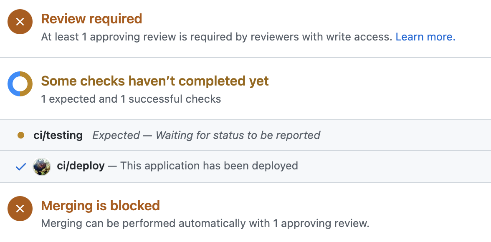

# **Continuous Delivery: Notifications**

## Integrations
Continuous Delivery Notifications is intended to make it easier to send notifications to pipeline-integrated resources.

## Available Resourses
### Github
- Pull Request comments:
  - Sending reports, logs or important information to determine the open pull request.

- Statuses check:
  - Status checks are based on external processes, such as continuous integration builds, which run for each push you make to a repository. You can see the pending, passing, or failing state of status checks next to individual commits in your pull request.
  
- Releases:
  - Releases are based on Git tags, which mark a specific point in your repository's history. A tag date may be different than a release date since they can be created at different times.

### Discord
WIP

### Telegram
WIP

### How-to use:
First of all, you need to declare the following variables.

```bash
export ORGANIZATION="MY-REPO-OWNER"
export REPOSITORY="TARGET-REPOSITORY"
export SHA="54abc98df637c73e8a98c1f2g34"
export GHTOKEN="ghp_ahjh82uehfe38uh38h38hf83fh83"
```

#### Status check:

**Available states:**  error, failure, pending and success.

**Available contexts:** ci/build, ci/deploy, ci/unittests and ci/codequality.

Using from the command line:

```bash
go run main.go github statuses --context ci/deploy --state success --description "This application has been deployed" --targetUrl http://jenkins.mycompany.io
```



#### Pull Request comments:
