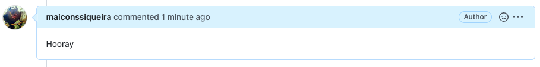
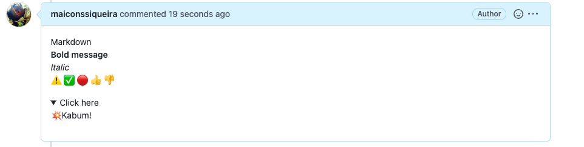
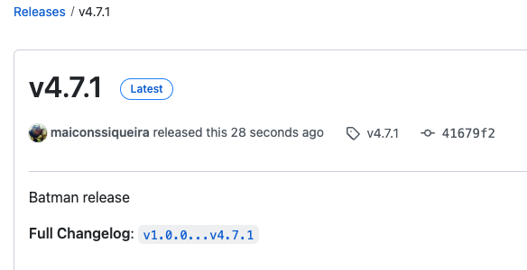

# *Notifications CLI*
[](https://github.com/maiconssiqueira/notifications-cli/actions/workflows/release.yaml)

[Feedback Notes](NOTES.md)

## Integrations
Continuous Delivery Notifications CLI was planned to make it easier to send notifications to pipeline-integrated resources.

## Available Resources
### Github
- Pull Request comments:
  - Sending reports, logs or important information to determine the open pull request.

- Statuses check:
  - Status checks are based on external processes, such as continuous integration builds, which run for each push you make to a repository. You can see the pending, passing, or failing state of status checks next to individual commits in your pull request.
  
- Releases:
  - Releases are based on Git tags, which mark a specific point in your repository's history. A tag date may be different than a release date since they can be created at different times.

### ToDo
* [ ] Send messages to Discord and Telegram
* [ ] Tests

### How-to use:
First of all, you need to declare the following variables.

```bash
export ORGANIZATION="MY-REPO-OWNER"
export REPOSITORY="TARGET-REPOSITORY"
export GHTOKEN="ghp_ahjh82uehfe38uh38h38hf83fh83"
```

#### Status check:

**Available states:**  error, failure, pending and success.

**Available contexts:** ci/build, ci/deploy, ci/unittests and ci/codequality.

Using from the command line:

```bash
go run main.go github statuses \
  --sha 8724893274347484h237432849h3487g343f434
  --context ci/deploy \
  --state success \
  --description "This application has been deployed" \
  --targetUrl http://jenkins.mycompany.io
```

<div>
  <center>
    
  </center>
</div>

---

#### Pull Request comments:
Using from the command line:
- ##### Simple text:
```bash
go run main.go github comments \
  --pullrequest 16 \
  --message "Hooray"
```
<div>
  <center>
    
  </center>
</div>

- ##### Markdown Text:
Write the message 
```bash
go run main.go github comments \
  --pullrequest 16 \
  --message "Markdown
  <br/> **Bold message**
  <br/> *Italic*
  <br/> :warning: :white_check_mark: :red_circle: :+1: :-1:
  <br/> <details> <summary>Click here</summary> :boom:Kabum! </details>"
```
<div>
  <center>
    
  </center>
</div>

---

#### Set branch release:
Using from the command line:

```bash
go run main.go github releases \
  --body "Batman release" \
  --name v4.7.1 \
  --tagName v4.7.1 \
  --targetCommitish main
```
<div>
  <center>
    
  </center>
</div>

---

By default the following items already have a value set:  
- ***Draft***: false 
- ***Pre-Release***: false
- ***Generate Release Notes***: true

If you want to set another value, you can use the following flags:
```bash
  -d, --draft                    True to create a draft (unpublished) release, false to create a published one
  -g, --generateReleaseNotes     Whether to automatically generate the name and body for this release. 
                                    If name is specified, the specified name will be used; otherwise, a name will be automatically generated. 
                                    If body is specified, the body will be pre-pended to the automatically generated notes (default true)
  -p, --prerelease               True to identify the release as a prerelease. false to identify the release as a full release
```
